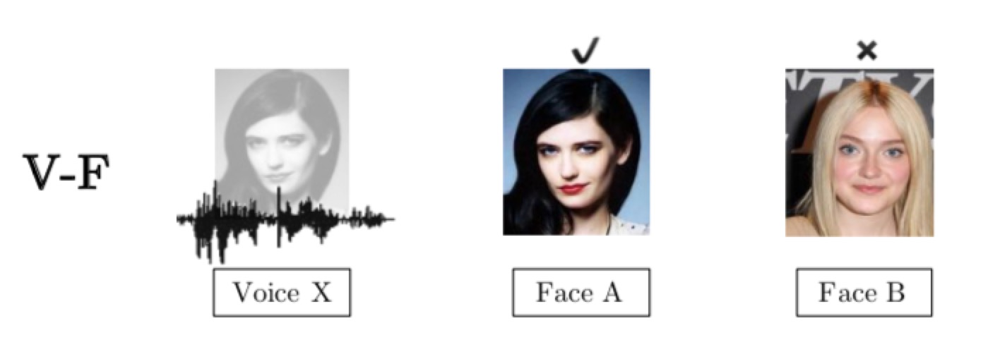
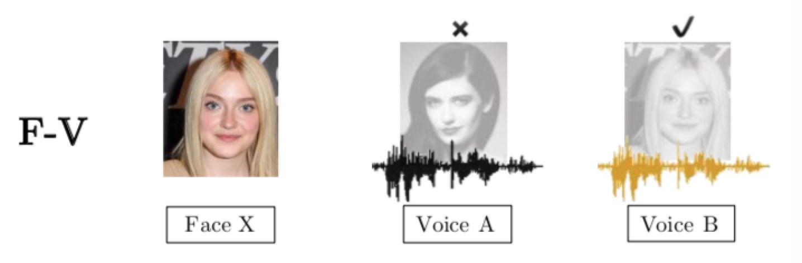
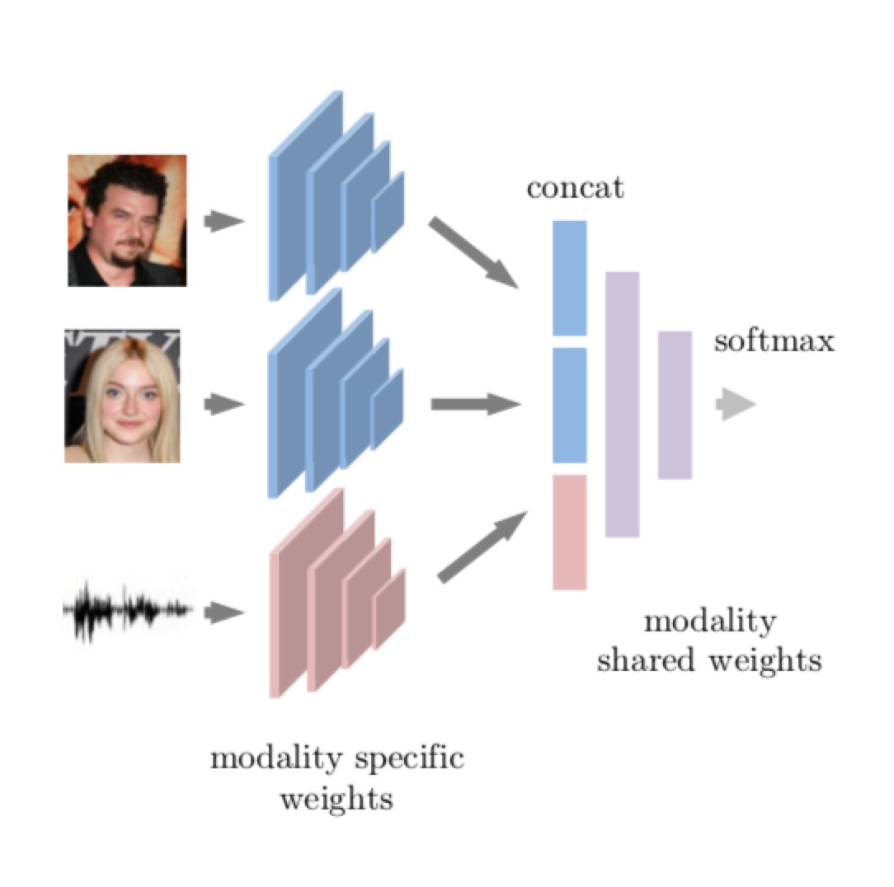
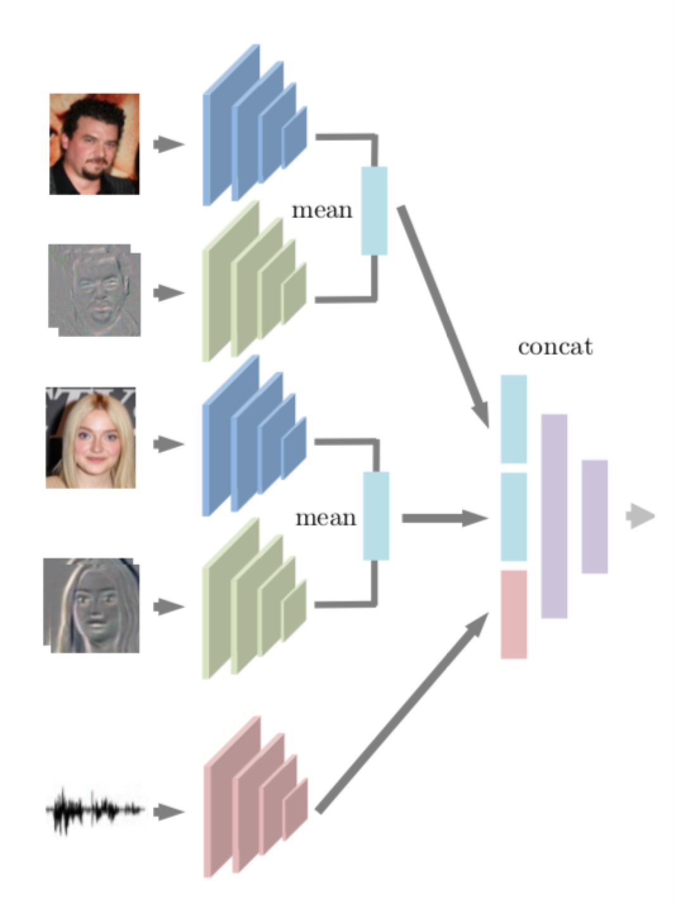
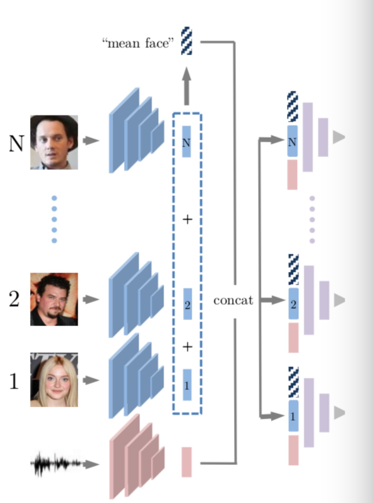
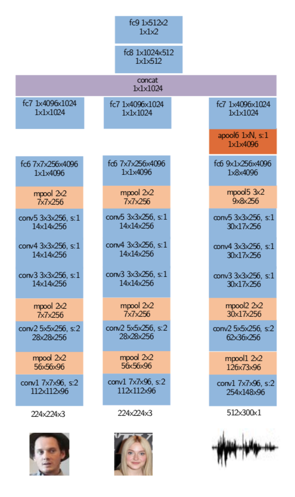

## Seeing Voices and Hearing Faces

### What this paper can do:

- Hearing faces, V-F(voice-face): given an audio clip of a voice and two or more faces, identify the face corresponding to the voice

- Seeing voices, F-V(face-voice): given a face image, identify the corresponding voice to the face among two or more voices

### Background：

> As humans, one may:
> 
> - form mental pictures of the face of a person after hearing a voice
> - form mental voices of a person after seeing the face 

### Solution

#### Dataset

- Description:
> `D = {x, y}` where `x = {v, f1, f2}` and `y = {1, 2}`, `y=1` means `f1` is the face to produce the voice `v`, `y=2` otherwise.

- Training data:
> **VGGFace** and **VoxCeleb** dataset, VGGFace contains static face images while VoxCeleb contains audio-visual information, 1247 pairs are used(face in VGGFace and audio-face in VoxCeleb).

#### NN Architecture

|3-stream|5-stream|n-stream(dynamic)|
|:---|:---:|---:|
||||

- 3-stream:
    1. `v`: voice NN
    2. `f1`: face NN
    3. `f2`: face NN

> All are VGG-M architecture(trade-off between efficiency and performance)

Then followed by `3072 --> 1024 --> 512 --> 2`, demostrated as:

### Parameters

- Optimizer: SGD, momentum=0.9, weight decay=0.0005
- Batch size: 64
- Pre-trained model: VGGFace and VoxCeleb models
- Epochs: 10 or error stop decreasing

### Possible Applications